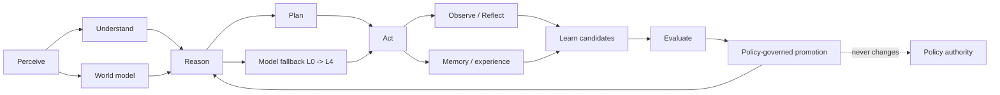

# AT_LLM AGI-Oriented Master Blueprint

## Purpose and claim boundary

AT_LLM is adopting a **governed, AGI-oriented architecture** as its target
state. This means the platform is designed around general cognitive loops,
memory, planning, tool use, multi-agent collaboration, reflection, and
governed improvement. It does **not** claim that the implementation is
human-level AGI: foundation models and deliberately bounded deterministic
components remain the underlying reasoning mechanisms.

## Comparison: control-plane foundation vs. AGI-oriented target

| Dimension | Current repository foundation | Master-blueprint target |
| --- | --- | --- |
| Core loop | Normalize, classify, apply policy, route, verify, audit | Perceive, understand, reason, plan, act, reflect, learn, and adapt under the same governance boundaries |
| Reasoning | Deterministic route and policy logic, with provider extension points | General reasoning strategies: deductive, inductive, abductive, causal, probabilistic, analogical, counterfactual, and meta-reasoning |
| World model | Pydantic input, intent, signal, and evidence contracts | Versioned facts, concepts, relations, events, causal hypotheses, and uncertainty with provenance |
| Memory | Explicit architectural boundary; no persistent implementation yet | Short-term, working, episodic, semantic, procedural, user, and experience memory behind policy and provenance controls |
| Agents | Route-specific planning and manager fabric | Supervisor-led cognitive fabric for research, engineering, analysis, creativity, planning, critique, recovery, verification, and security |
| Models | Auditable L0–L4 plan; L3 deterministic engine is active without configured providers | Provider-neutral L0 primary (including OpenRouter), L1 secondary, L2 local, L3 deterministic, and L4 human escalation |
| Learning | Experience is recorded as a candidate only; no autonomous promotion | Observe, hypothesize, experiment, evaluate, regression/safety test, promote versioned routes/models/skills, or roll back |
| Authority | Policy Manager is the final authority | Unchanged: models, agents, memory, tools, and learning have no policy authority |

## Non-negotiable safety boundaries

1. **Policy is the final authority.** No model, agent, tool, memory item, or
   learning candidate can change policy or grant permissions.
2. **Learning is candidate-only.** A proposed improvement requires historical,
   regression, and safety evaluation plus a governed promotion decision.
3. **Memory is not policy.** Retrieved memory supplies context only and must
   preserve provenance, retention, privacy, and tenant boundaries.
4. **Tools are authorized-only.** Every tool invocation needs policy-approved
   capability selection, validated input, a sandbox where applicable, and
   verified results before response synthesis.
5. **Fallback is truthful and auditable.** The system records unavailable or
   failed providers and must not represent a provider as executed when it was
   not. Unsafe or insufficient work reaches L4 human escalation.
6. **No unapproved external or physical side effects.** Planning is not
   authorization; execution requires an explicit policy decision.

## Delivery roadmap

### Phase 1 — Governed cognitive contracts (current focus)

- Keep canonical input, intent, policy, routing, evidence, verification, audit,
  L0–L4 fallback, and learning-candidate contracts stable.
- Add a cognitive-cycle trace to every run: perception, understanding,
  reasoning, planning, action decision, reflection, and evaluation state.
- Preserve the current deterministic L3 execution path as the safe baseline.
- Seal the canonical state and audit digest only after the verification and
  final-policy release path completes; drafts remain internal artifacts.

### Phase 2 — Stateful knowledge and memory

- Add tenant-isolated stores for episodic, semantic, procedural, and experience
  memory with retention, provenance, and retrieval policy enforcement.
- Introduce a versioned world model/knowledge graph; facts and causal
  hypotheses must retain sources, confidence, timestamps, and uncertainty.

### Phase 3 — Governed model and tool adapters

- Implement authorized adapters for OpenRouter L0, configured secondary L1
  providers, and local Ollama/vLLM L2 inference.
- Add timeout, invalid-output, verification-failure, and recovery conditions
  that drive the real L0 → L4 fallback sequence.
- Implement tool registry, authorization, sandboxing, result validation, and
  side-effect confirmation.

### Phase 4 — Multi-agent planning and evaluated improvement

- Execute supervisor-managed task graphs with checkpoints, bounded retries,
  recovery, and verifier gates.
- Persist observations and human feedback; produce only versioned learning,
  model-routing, tool-selection, and skill candidates.
- Require benchmark, historical, regression, and safety evaluation before a
  human- or policy-governed promotion; support rollback for every promoted
  version.

## Acceptance criteria for each future capability

A new cognitive, memory, model, tool, skill, or learning feature is accepted
only when it has: a typed contract, policy decision point, provenance/tenant
boundary where data is used, verification behavior, immutable audit event,
failure/fallback behavior, and tests for denial or escalation paths.
