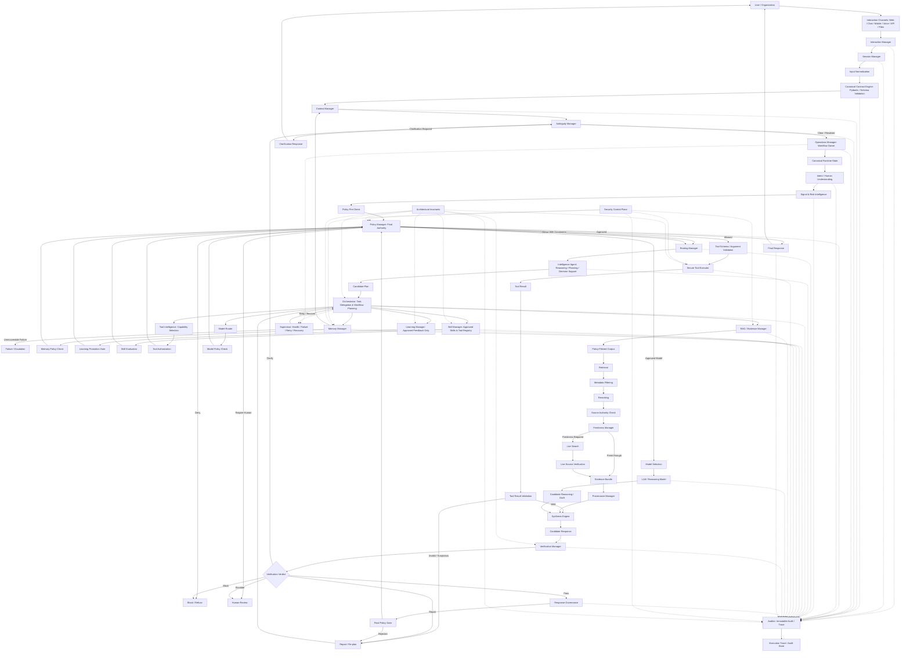

# AI Agent Platform Reference Architecture

This implementation follows the supplied end-to-end flowchart as an executable, deterministic control-plane skeleton. The current code does not pretend to implement every external integration; instead, it exposes contract objects and auditable stage outputs for each major architectural concern so storage, model, RAG, tool, Tableau, and LangGraph/Ruflo adapters can be plugged in safely.

## Runtime flow

## Contract coverage

| Flowchart concern | Implemented contract / field |
| --- | --- |
| Input contract, session, interaction channel | `InputContract` |
| Interaction, session, context, ambiguity, operations, invariants | `RuntimeStateContract` |
| Intent, sentiment, urgency, ambiguity, entities, goals | `IntentContract` |
| Composite signal score | `SignalContract` |
| Policy Manager final authority and constraints | `PolicyContract` |
| Routing, domain, agent, model, tools, topology, risk | `RouteContract` |
| Intelligence agent, candidate plan, orchestrator, supervisor, manager fabric | `PlanContract` |
| Conditional edge policy | `DecisionContract` |
| Evidence and provenance | `EvidenceContract` |
| Evidence, policy, factual, citation, risk, and format verification | `VerificationContract` |
| Observability and strict auditor | `AuditEvent` and `production_gate` |
| Final response contract | `AgentResult` |

## Extension points

- Replace deterministic keyword scoring with a model-backed intent classifier while preserving `IntentContract`.
- Attach PostgreSQL + pgvector repositories behind `EvidenceContract` and audit persistence.
- Add tool adapters under the tool registry while enforcing permissions, idempotency, and side-effect metadata.
- Add LangGraph or Ruflo execution adapters behind the topology and orchestrator stages.
- Feed audit and route history into governed SQL views for Tableau dashboards.
